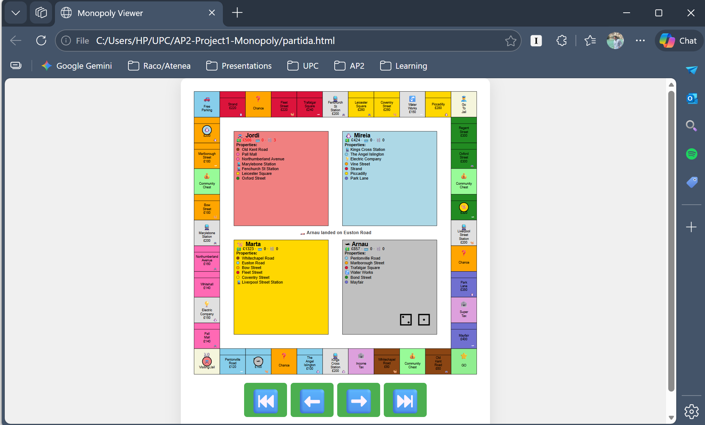
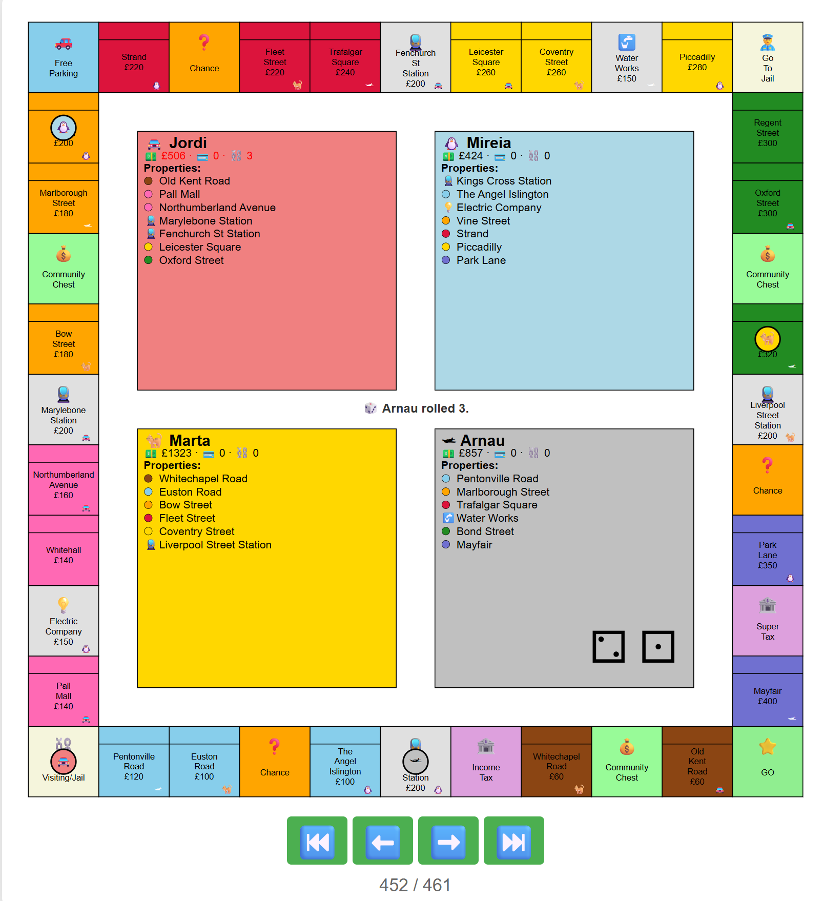

# First AP2 practice: Monopoly

This project is a fully-automated Monopoly simulation which allows users to visualize the development of the game through a web browser.

## The Monopoly game
Monopoly is a classic, competitive board game where players buy, rent, and mortgage property, aiming to bankrupt opponents to become the last remaining player. Players move around the board based on dice rolls, collecting money, investing in houses/hotels, and dealing with chance cards.

### Key aspects of the game
- **Goal**: To bankrupt all opponents by charging rent on owned property.
- **Monopoly**: Players should attempt to buy up all property in a color group (a "monopoly") to build houses and hotels, significantly increasing rent.
- **Components**: A board with 40 spaces (properties, stations, utilities, taxes), tokens, dice, "Chance" and "Community Chest" cards, and monopoly money.
- **Origins**:  Originally derived from The Landlord's Game, created by Elizabeth Magie in 1903 to demonstrate the dangers of wealth concentration.

### Ordinary rules
**Core rules & Gameplay**
- **Starting conditions:**
Each player begins in the "GO" position, without any properties and with $1,500
- **Turns:** Roll both dice. Move clockwise. Rolling doubles allows another turn (3 doubles in a row takes the player to jail without passing go.)
- **Property:** Landing on unowned property allows you to buy it at the printed price.
- **Rent:** Landing on owned property requires paying rent (doubled if the owner has all colors in a set).
- **Buildings:** Once a color set is owned, you can buy houses, then hotels, to increase rent. Must build and sell evenly.
- **Jail:** Can be sent to jail by "Go to Jail" space, 3 doubles, or "Go to jail" card. Can get out by using a card, rolling doubles or after three turns in prison.

**Types of tiles**
- **Streets:** The most common tiles. Owning all properties of one color allows you to build Houses and Hotels to increase rent.
- **Railroads:** There are four on the board. The rent increases based on how many railroads the owner possesses 
- **Utilities (Electric & Water):** Rent is determined by a dice roll. If the owner has one utility, you pay 4x the dice roll; if they have both, you pay 10x.
- **Go**: Every time you land on or pass this tile, you collect $200 from the Bank.
- **Chance & Community Chest:** You must draw the top card from the corresponding deck and follow its instructions.
- **Income Tax & Luxury Tax:** You must pay the specified amount ($200 or $100) directly to the Bank.
- **Free Parking:** This is a free resting space with no prize or action. 
- **Just visiting:** If you land here by a regular dice roll, you are safe and nothing happens.

### Special rules for this project

In order to make the simulation work neatly, as well as to improve the user's experience, several rules were implemented.

- **Player limit:** The simulation can be played by 2, 3 or 4 players.
- **Not buying:** Deciding not to buy a property does not put the property to auction.
- **Trading not allowed:** Trading between players is not allowed. 
- **Getting out of prison:** After three turns in prison the player is automatically sent out of jail, there is no need to pay $50.
- **Bankruptcy:** If a player doesn't have enough funds to pay rent or card, the player is declared bankrupt and cannot keep on playing. The properties of the player are returned back to the bank. 
- **Bankruptcy to another player:** If bankrupt to another player, the owner does not receive the properties of the debtor, but the bank pays for the rest of the rent.
- **Game ending:** The game ends when all but one player is left standing. 
- **Round limit:** A 500 rounds default is set as to prevent overly-long games. If the limit is reached and more than two players are left standing, the winner is whichever player has the most money, not taking properties into account.

## Features

**Core Simulation Engine**
- **Automated Game Loop:** Executes games autonomously up to a configurable turn limit or until all but one player goes bankrupt.
- **Data-Driven Initialization:** The board layout, player profiles, and event decks are dynamically loaded from structured JSON files, completely separating data from the core logic.

**Strategy & Game Mechanics**
- **Strategic Behaviors:** Implements varied decision-making models via a Strategy pattern. Includes a `SimpleStrategy` (opportunistic purchasing) and a `SmartStrategy` (advanced liquidity management, asset mortgaging, and dynamic house/hotel development).
- **Comprehensive Ruleset:** Handles complex Monopoly states, including jail mechanics, passing GO, dynamic rent calculations, and the execution of diverse Chance and Community Chest cards.

**Visualization & Playback**
- **SVG Rendering:** Captures the board state at every event, generating clean snapshots detailing player positions, financial metrics, dice rolls, and property ownership.
- **Event Logging:** Implements a news ticker to chronologically log significant game events, providing a clear narrative of the game's progression.
- **Interactive Web Viewer:** Compiles the generated SVG frames into an interactive HTML interface with playback controls (⏮️, ⬅️, ➡️, ⏭️), allowing for granular, turn-by-turn analysis of the simulation.
- **User Interaction:** The simulation prompts the user for the number of players at the start, allowing for a customizable gaming experience while maintaining simplicity in execution.
- **Deterministic Testing:** Includes a pre-configured random seed (`[4]`) that guarantees a fast-resolving game (142 turns), enabling consistent testing and demonstration of the simulation's capabilities.

## Requirements & Execution
### Dependencies
For this project you only need drawsvg, a Python library for drawing vector graphics in SVG format.
Installation: 
```bash
python -m pip install drawsvg 
```
The file drawsvg.pyi provides the necessary types for drawsvg.

### How to Run the Simulation
In order to run the simulation, simply follow the instructions below:
1. Open a terminal and navigate to the project directory.
2. Run the command
```bash
python main.py
```
3. When prompted, enter the number of players (2, 3, or 4) and press Enter.
4. The simulation will begin, printing `--- Starting Monopoly Simulation ---` to the terminal.
5. The simulation will generate SVG frames for each turn in the `frames/` directory.

###  Important Note on Randomness & Determinism

By default, this simulation is deterministic. Inside `main.py`, the random number generator is locked to a specific starting point (`random.seed(4)`). 

- **Reason:** Monopoly is notorious for ties. A completely random game can easily drag on for thousands of turns, generating a massive directory of SVG frames that will eat up storage and slow down your browser during playback. This specific "Fast Seed" was chosen because it guarantees a highly volatile economy and a definitive winner in exactly 142 turns, making it perfect for quickly demonstrating the simulation's visual pipeline.

- **How to Enable True Randomness:**
If you want to run a completely unique, unpredictable simulation, you must remove this lock. 
    1. Open `main.py`.
    2. Locate and delete (or comment out) the line that says `random.seed(4)`.
    3. Run the script. Python will now generate a completely random game. 
    
    *(Note: You can always add the seed back later to reproduce the 142-turn demo).*

### How to View the Slideshow
Once the simulation is complete, you can view the generated frames as an interactive slideshow in your web browser:
1. Run the command 
```bash
python slideshow.py partida.html frames/frame_*.svg
```
2. This will create an `partida.html` file in the project directory.
3. Open `partida.html` in your web browser to view the slideshow of the Monopoly game.
4. From there, you can navigate through the turns using the provided controls to see how the game unfolded visually.

Example of the slideshow interface:



## Architecture & Module Specification

The system is built with a strictly modular, object-oriented architecture. The core simulation engine is completely decoupled from the visualization layer. All data ingestion (properties, cards, players) is handled dynamically via JSON files, ensuring the codebase remains agnostic to the specific game configuration.

The project is divided into the following key modules:

### Core Execution & Configuration
* **`main.py`**: The entry point of the simulation. It handles environment setup (cleaning old frames), requests user input for the number of players, initializes the `Board` with the required JSON data files, and triggers the main game loop.
* **`const.py`**: A centralized configuration file storing universal game constants (e.g., `MAX_TURNS`, `START_MONEY`, `GO_SALARY`) to allow for easy adjustments of game parameters without modifying core logic.

### Game Orchestration
* **`board.py`**: The central orchestrator of the simulation. The `Board` class acts as the single source of truth for the game state. 
  * **Responsibilities:** Loads and builds all board entities from JSON, manages the turn-based game loop (`play()`), tracks the current player, handles dice rolls, enforces jail rules, checks end-game conditions, and triggers frame snapshots for the visualization layer.

### Game Entities & Logic
* **`player.py`**: Defines the `Player` class, which encapsulates all state related to a participant (position, capital, owned properties, jail status, bankruptcy). 
  * **Responsibilities:** Exposes methods to mutate the player's state legally (e.g., `move()`, `pay()`, `go_to_jail()`, `declare_bankruptcy()`) and delegates decision-making to the injected strategy.
* **`strategy.py`**: Defines the decision-making interface for automated players.
  * **Responsibilities:** The abstract `PlayerStrategy` dictates the contract for purchasing decisions and portfolio management. Concrete implementations (`SimpleStrategy`, `SmartStrategy`) execute specific logical behaviors based on the player's current liquidity and asset state.
* **`tile.py`**: Defines the board spaces. The base `Tile` class provides a common interface.
  * **Responsibilities:** Specific subclasses (`Property`, `Street`, `Station`, `Utility`, `Tax`, `Special`) implement their own specific `land_on(player)` logic, utilizing polymorphism to handle the distinct rules of each square.
* **`card.py` & `deck.py`**: Manage the Chance and Community Chest systems.
  * **Responsibilities:** `Deck` handles the shuffling and drawing mechanics. `Card` serves as an abstract base class, with specialized subclasses (`MoneyCard`, `MoveCard`, `JailCard`, etc.) overriding the `execute()` method to apply specific effects to the player or board.

### Visualization Layer
* **`draw.py`**: The rendering engine. 
  * **Responsibilities:** Translates the current state of the `Board` into a static SVG file using the `drawsvg` library. It handles all visual positioning, color mapping, and typography.

* **`slideshow.py`**: The playback generator. 
  * **Responsibilities:** Ingests the directory of generated SVG frames and compiles them into an interactive HTML page with navigation controls for turn-by-turn playback.

  Example of the board visualization:
    

## Design Decisions 

- **Strategy Pattern**: The decision to abstract player strategies into separate classes (`SimpleStrategy` and `SmartStrategy`) allows for flexible behavior. This design enables us to easily swap out or add new strategies without modifying the core `Player` class.
- **Strategy Assignation**: By assigning `SmartStrategy` to the first player and `SimpleStrategy` to the others, we can simulate a more competitive environment while still having a baseline for comparison. This also further promotes a faster convergence towards a winner, as the `SmartStrategy` player will make more informed decisions.
- **Factory Pattern**: The use of factory functions (`build_card` and `build_player`) to instantiate objects from JSON data promotes clean code and separation of concerns. It allows for easy extension of card types or player types in the future without modifying existing code.
- **Separation of Rendering**: The clear separation between game logic (`board.py`) and rendering logic (`draw.py`) ensures that the core mechanics of the game are not intertwined with the visual representation. This modularity allows for easier maintenance and potential future enhancements, such as changing the rendering method or adding new features without affecting the game logic.
- **Turn Limit**: Implementing a turn limit (500 turns) prevents the simulation from running indefinitely in cases where players are evenly matched and no clear winner emerges. This ensures that the simulation can conclude in a reasonable timeframe, even if it means declaring a winner based on who has the most money at the end of the turn limit. This can be easily modified through the `const.py` file if a different limit is desired.
- **Bankruptcy Handling**: The decision to return properties to the bank upon bankruptcy, rather than transferring them to the creditor player, simplifies the game mechanics and prevents potential complications in ownership and rent calculations. This also allows for a more dynamic game state, as properties can be re-acquired by other players in subsequent turns.
- **No Trading**: By not allowing trading between players, the simulation focuses more on the core mechanics of property acquisition and rent collection. This simplifies the decision-making process for players and allows for a clearer analysis of the strategies in play.
- **News ticker**: Implementing a news ticker to log events from dice rolls, property purchases, rent payments, to  bankruptcies, enhances the user experience by providing a clear narrative of the game's progression. This feature allows users to easily follow the key moments of the game and understand how the strategies are unfolding. 
- **Quick game seed**: Because this simulation generates a high-quality SVG frame for every game event, standard Monopoly games can produce thousands of files and take a while to render. By setting a specific random seed that leads to a fast-resolving game (142 turns), we can ensure that the demonstration runs quickly while still showcasing the full range of game mechanics and strategies. This allows for efficient testing and presentation without sacrificing the depth of the simulation.
- **`Board` as the main orchestrator**: By centralizing the game loop and turn management within the `Board` class, we can maintain a clear flow of the game. This design allows for better control over the sequence of events and ensures that all game actions are coordinated effectively.
- **Use of JSON for configuration**: Storing card and player configurations in JSON files allows for easy modification and extension of game elements without changing the code. This design choice promotes flexibility and makes it easier to add new cards or player types in the future.

## Future Improvements 

In order to further enhance the simulation, several features could be added in the future:
- **Trading between players**: Implementing a trading system would allow players to negotiate property exchanges, adding a layer of strategy and interaction.
- **More complex strategies**: Developing more sophisticated strategies that consider the current game state.
- **UI enhancements**: Improving the visual presentation of the game, such as adding animations, sound effects, or a more interactive interface for player decisions.

# Authors

Miguel Pacheco Daneri

©️ Universitat Politècnica de Catalunya, 2026